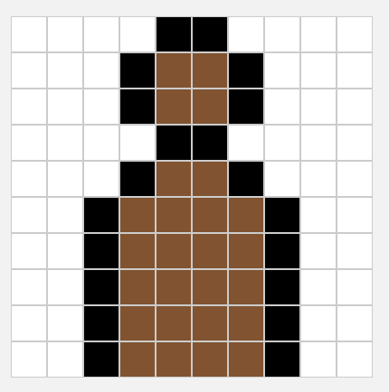

# Colors

## Binary

111111111111111111111111 111111111111111111111111 
111111111111111111111111 111111111111111111111111 000000000000000000000000 100010010101000100101001 100010010101000100101001 100010010101000100101001 100010010101000100101001 000000000000000000000000 111111111111111111111111 111111111111111111111111 
111111111111111111111111 111111111111111111111111 000000000000000000000000 100010010101000100101001 100010010101000100101001 100010010101000100101001 100010010101000100101001 000000000000000000000000 111111111111111111111111 111111111111111111111111 
111111111111111111111111 111111111111111111111111 000000000000000000000000 100010010101000100101001 100010010101000100101001 100010010101000100101001 100010010101000100101001 000000000000000000000000 111111111111111111111111 111111111111111111111111 

## Hexadecimal

FFFFFF FFFFFF FFFFFF 000000 895129 895129 000000 FFFFFF FFFFFF FFFFFF 
FFFFFF FFFFFF FFFFFF FFFFFF 000000 000000 FFFFFF FFFFFF FFFFFF FFFFFF 
FFFFFF FFFFFF FFFFFF 000000 895129 895129 000000 FFFFFF FFFFFF FFFFFF 
FFFFFF FFFFFF 000000 895129 895129 895129 895129 000000 FFFFFF FFFFFF 
FFFFFF FFFFFF 000000 895129 895129 895129 895129 000000 FFFFFF FFFFFF 
FFFFFF FFFFFF 000000 895129 895129 895129 895129 000000 FFFFFF FFFFFF 
FFFFFF FFFFFF 000000 895129 895129 895129 895129 000000 FFFFFF FFFFFF 
FFFFFF FFFFFF 000000 895129 895129 895129 895129 000000 FFFFFF FFFFFF 

