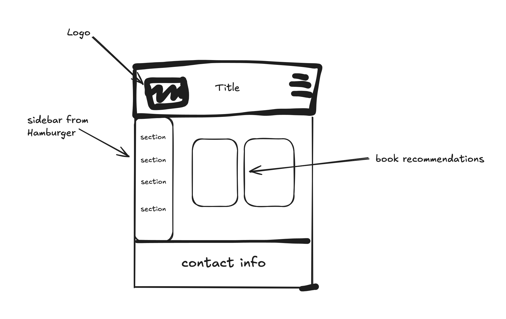

# Relfection/Process

## Meeting 1

- Over text, Jan 20th
- I showed my client a sketch of index.html
- She gave me a [website to use as a template](https://rzm.com/?srsltid=AfmBOoqkCJ7X5QdoEN3ocJGtgRRDbABIEXystr641YvIFkXLLZ_-mxmD)
- I agreed to with her wishes and followed the template site loosely

## Meeting 2

- Over text, Jan 24th
- I showed her the new site with a hero, hamburger icon, and a rough html card
- She said "That looks great!" and gave me the text she wanted to be inserted
- I agreed to insert all of the text

## Meeting 3

- Over text, Jan 27
- I showed her the "about" and "Events" sections, as well as asking her to make the text shorter to easily fit on the screen
- She thought it looked good and asked for me to shorten it
- I agreed to shortining it and promtply sent the code over to her after double checking everything