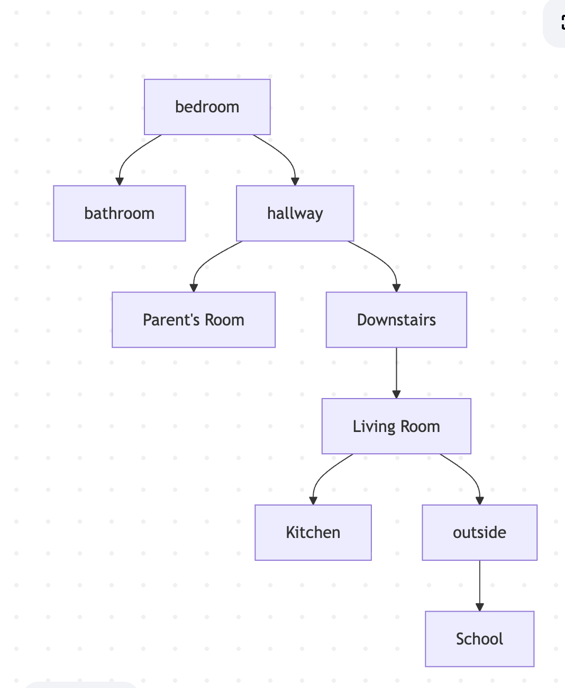

# Wake Up Prithvi

## setting

The setting is in Prithvi's home in the morning.

## Map

## Story

The player is a student named Prithvi who just woke up and needs to get ready for school before time runs out.

## Variables

- Time - creates sense of urgency and actually allows the player to lose
